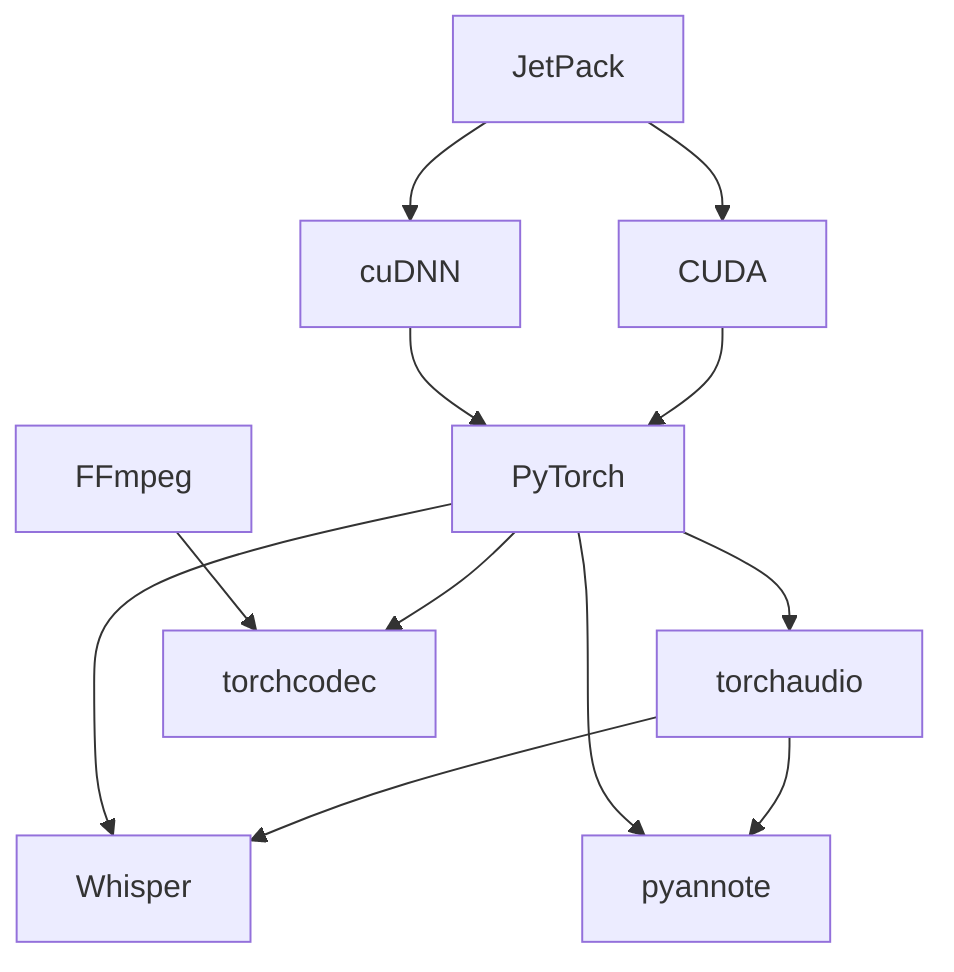

# Jetson Orin Nano – Whisper + pyannote Dev Environment

This document summarizes a practical, end‑to‑end approach to setting up a development environment for running **OpenAI Whisper** and **pyannote.audio** on **NVIDIA Jetson Orin Nano**. It is written as a README that can also stand alone as a blog post. The focus is on correctness, reproducibility, and understanding the dependency graph rather than providing a one‑click script.

---

## 1. Target Platform and Constraints

**Hardware**

- NVIDIA Jetson Orin Nano (Ampere GPU)
- GPU compute capability: **sm_87**

**Key Constraints**

- ARM64 (aarch64) Linux
- NVIDIA‑supplied CUDA and cuDNN (JetPack‑managed)
- Limited availability of prebuilt Python wheels compared to x86_64

---

## 2. High‑Level Software Stack

At a high level, the stack looks like this:

- JetPack (OS + drivers + CUDA + cuDNN)
- CUDA 12.9 (provided by JetPack)
- PyTorch (built for aarch64 + CUDA 12.x, sm_87)
- torchaudio
- torchcodec
- FFmpeg (with required codecs enabled)
- Whisper
- pyannote.audio

---

## 3. Dependency Graph



This graph is useful when debugging installation failures: most issues arise from mismatched CUDA / PyTorch / FFmpeg expectations.

---

## 4. JetPack and CUDA Baseline

Before installing or upgrading any CUDA-dependent software, ensure the system is fully prepared.

### CUDA Repository Keyring and cuSPARSELt

Install the CUDA keyring and **cuSPARSELt** early, before any CUDA-aware Python packages.

#### CUDA Keyring

```bash
sudo apt update
sudo apt install -y cuda-keyring
sudo apt update
```

#### cuSPARSELt (PyTorch‑recommended install method)

cuSPARSELt should be installed using the official PyTorch helper script, which ensures compatibility with the active CUDA toolchain.

```bash
wget https://raw.githubusercontent.com/pytorch/pytorch/5c6af2b583709f6176898c017424dc9981023c28/.ci/docker/common/install_cusparselt.sh
chmod +x install_cusparselt.sh

# Set CUDA version explicitly
export CUDA_VERSION=12.9

bash ./install_cusparselt.sh
```

This method:

- Installs the correct cuSPARSELt build for the CUDA version in use
- Avoids mismatches with JetPack‑provided CUDA libraries
- Matches the expectations of modern PyTorch (2.8+)

### System Update

After the keyring and cuSPARSELt are installed, bring the system fully up to date:

```bash
sudo apt update
sudo apt upgrade
```

### JetPack Version

You need a **JetPack 6.x** release providing **CUDA 12.9** on Orin Nano.

JetPack provides:

- Ubuntu 22.04 (rootfs)
- NVIDIA kernel + drivers
- CUDA Toolkit (12.9)
- cuDNN and TensorRT

**Important:** Do not install CUDA manually from NVIDIA’s generic Linux installers. Jetson devices must use the CUDA version bundled with JetPack.

Verify after flashing or upgrading:

```bash
nvcc --version
bash
nvcc --version
nvidia-smi
```

(On Jetson, `nvidia-smi` exists but reports limited information compared to x86.)

---

## 5. cuDSS Installation

cuDSS is required for certain PyTorch operations.

Download and install from NVIDIA:

```bash
wget https://developer.download.nvidia.com/compute/cudss/0.7.1/local_installers/cudss-local-tegra-repo-ubuntu2204-0.7.1_0.7.1-1_arm64.deb
sudo dpkg -i cudss-local-tegra-repo-ubuntu2204-0.7.1_0.7.1-1_arm64.deb
sudo cp /var/cudss-local-tegra-repo-ubuntu2204-0.7.1/cudss-*-keyring.gpg /usr/share/keyrings/
sudo apt-get update
sudo apt-get -y install cudss
```

---

## 6. Python Environment Strategy

Use **Python 3.10** (JetPack 6 default) and isolate dependencies.

Recommended options:

- `venv` (simplest)
- `conda` / `mamba` (heavier, but easier for FFmpeg sometimes)

Example:

```bash
python3 -m venv venv
source venv/bin/activate
pip install --upgrade pip setuptools wheel
```

### Automated Setup Script

For convenience, use the provided `setup_venv.sh` script to create the virtual environment and install all required dependencies:

```bash
./setup_venv.sh
```

After running the script, activate the environment with:

```bash
source venv/bin/activate
```

**Note:** Ensure FFmpeg is properly installed (see Section 9) before using torchcodec.

### Upgrading Dependencies

To upgrade pip and installed packages in an existing virtual environment:

```bash
source venv/bin/activate
./upgrade_deps.sh
```

---

## 7. PyTorch, torchaudio, torchcodec for CUDA 12.9 (sm_87)

### CUDA Baseline

After the latest JetPack 6 upgrade, the CUDA toolchain reports:

```bash
nvcc --version
# Cuda compilation tools, release 12.9, V12.9.86
```

This establishes **CUDA 12.9** as the required baseline for all PyTorch‑related components.

### JetPack 6 + CUDA 12.9: Prebuilt Wheels (Recommended)

For this configuration, use the Jetson AI Lab wheel index:

```
https://pypi.jetson-ai-lab.io/jp6/cu129/
```

This repository provides mutually compatible wheels built for:

- aarch64 (Jetson)
- CUDA 12.9
- Ampere GPUs (sm_87)

### Version Matrix (Known‑Good)

| Component  | Version |
| ---------- | ------- |
| CUDA       | 12.9    |
| PyTorch    | 2.9.0   |
| torchaudio | 2.9.0   |
| torchcodec | 0.8.0   |

### Installation

```bash
pip install --extra-index-url https://pypi.jetson-ai-lab.io/jp6/cu129/ \
    torch==2.9.0 \
    torchaudio==2.9.0 \
    torchcodec==0.8.0
```

Pinning versions is strongly recommended to avoid accidental ABI or CUDA mismatches during future upgrades.

### Verification

```python
import torch
import torchaudio
import torchcodec

print(torch.__version__)
print(torchaudio.__version__)
print(torchcodec.__version__)
print(torch.cuda.is_available())
print(torch.cuda.get_device_name(0))
```

[https://pypi.jetson-ai-lab.io/jp6/cu129/](https://pypi.jetson-ai-lab.io/jp6/cu129/)

````

This repository provides wheels that are:
- Built for **aarch64**
- Linked against **CUDA 12.9**
- Compatible with **Ampere (sm_87)**

Example installation:

```bash
pip install --extra-index-url https://pypi.jetson-ai-lab.io/jp6/cu129/ \
    torch torchaudio
````

This is the safest and fastest path and should be preferred over source builds unless you need a custom PyTorch version.

### Verification

```python
import torch
print(torch.__version__)
print(torch.cuda.is_available())
print(torch.cuda.get_device_name(0))
```

---

## 8. torchaudio

`torchaudio` must be **ABI‑compatible** with your PyTorch build.

Rules of thumb:

- Same PyTorch version
- Same CUDA version
- Same compiler toolchain

If NVIDIA provides a matching wheel, use it. Otherwise, build from source:

```bash
git clone https://github.com/pytorch/audio.git
cd audio
python setup.py install
```

Verify:

```python
import torchaudio
print(torchaudio.__version__)
```

---

## 9. FFmpeg (Critical for torchcodec)

### Why FFmpeg Is Required

`torchcodec` depends on FFmpeg for:

- Audio decoding
- Container handling
- Codec support

### Minimum FFmpeg Requirements

- libavcodec
- libavformat
- libavutil
- libswresample

On Jetson, system FFmpeg packages are often:

- Too old
- Built without required codecs

### Recommended Approach

Build FFmpeg from source with shared libraries enabled:

```bash
./configure \
  --enable-shared \
  --enable-gpl \
  --enable-libopus \
  --enable-libvorbis
make -j$(nproc)
sudo make install
sudo ldconfig
```

Verify:

```bash
ffmpeg -codecs | grep opus
```

---

## 10. torchcodec

`torchcodec` bridges PyTorch and FFmpeg.

Key requirements:

- FFmpeg discoverable via `pkg-config`
- Matching PyTorch version

Install:

```bash
pip install torchcodec
```

If this fails, inspect:

- `pkg-config --libs libavcodec`
- `ldd` on FFmpeg shared objects

---

## 11. Whisper

Whisper uses:

- PyTorch (GPU inference)
- torchaudio (audio I/O)

Install:

```bash
pip install openai-whisper
```

Test:

```bash
whisper --help
```

Performance notes on Orin Nano:

- FP16 recommended
- Small / medium models are realistic
- Large models may be memory‑constrained

---

## 12. pyannote.audio

`pyannote.audio` adds speaker diarization on top of PyTorch and torchaudio.

Install:

```bash
pip install pyannote.audio
```

Notes:

- Some pipelines require Hugging Face authentication
- GPU acceleration depends entirely on PyTorch CUDA correctness

---

## 13. Common Failure Modes

| Symptom                              | Likely Cause                                     |
| ------------------------------------ | ------------------------------------------------ |
| `torch.cuda.is_available() == False` | PyTorch built without CUDA or wrong CUDA version |
| torchaudio import error              | ABI mismatch with PyTorch                        |
| torchcodec build failure             | FFmpeg not found or missing shared libs          |
| Runtime codec errors                 | FFmpeg built without required codecs             |

---

## 14. Final Sanity Checklist

- [ ] JetPack 6.x installed
- [ ] CUDA 12.9 visible via `nvcc`
- [ ] PyTorch reports CUDA and sm_87 GPU
- [ ] torchaudio imports cleanly
- [ ] FFmpeg supports required codecs
- [ ] torchcodec imports cleanly
- [ ] Whisper runs inference
- [ ] pyannote pipeline executes on GPU

---

## 15. Closing Notes

The Jetson Orin Nano is capable of running Whisper and pyannote effectively, but only if the CUDA–PyTorch–FFmpeg chain is aligned precisely. Treat the dependency graph as authoritative: when something breaks, trace upward and downward before changing versions blindly.

This README is intentionally modular; each section can be split into its own file if you choose to turn this into a multi‑page blog or documentation set.
